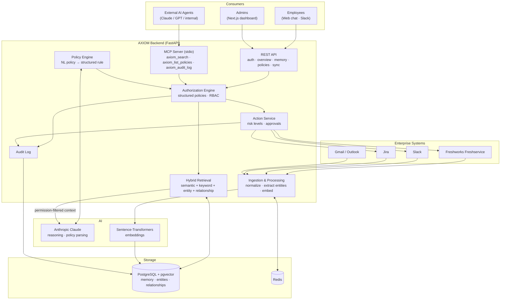

# AXIOM

The memory layer for enterprise AI: a unified, permission-aware context layer that serves employees and AI agents across the systems they already use.

## What it is

AXIOM connects an organization's existing systems (Freshservice, Slack, Jira, Gmail) and builds a continuously updated **organizational memory** out of them: people, teams, projects, tickets, conversations, decisions and how they relate. It exposes that memory to employees through web chat and Slack, and to AI agents through MCP. Every request goes through a deterministic, policy-driven authorization engine.

## What it does (business objective)

Companies have plenty of data but no unified memory. The customer email, the Slack debate, the Jira issue and the Freshservice incident behind one business event all live in different tools. AXIOM:

- **Reconstructs context across systems.** It can answer questions like *"Why is the customer's payment issue still unresolved?"* with grounded evidence (source, timestamp, link), and says *"not enough evidence"* instead of guessing.
- **Enforces natural-language policy.** Admins write rules such as *"Only HR administrators can access compensation information"*. AXIOM turns each rule into a structured policy and evaluates it deterministically. The LLM is never the security boundary.
- **Filters by permission before retrieval.** Only authorized context ever reaches the model.
- **Takes controlled actions.** It can create or update Jira issues and Freshservice tickets and send Slack messages. Actions are gated by risk level, approvals and the same authorization engine.
- **Gives agents one shared, governed integration.** AI agents get enterprise context through AXIOM's MCP server instead of each one integrating separately with every system.
- **Keeps a full audit trail.** Every retrieval, denial, policy decision and action is logged.

Target outcomes: faster answers to cross-system questions, fewer repeated rediscoveries of institutional knowledge, and **zero unauthorized successful actions**.

## What it doesn't do (out of scope)

- **Not a system of record.** Source systems stay authoritative. AXIOM keeps a contextual index and does not replace them.
- **Not a general enterprise search or dashboard product.** The UI is deliberately minimal: a chat workspace, a knowledge graph view and settings (access rules).
- **Not an IAM/SSO provider.** It consumes identity and roles but does not manage user identities.
- **No LLM-decided authorization.** Access decisions are never delegated to the model.
- **Nothing beyond the MVP connectors yet.** Meeting notetakers, Google Drive, SharePoint, Confluence, GitHub, HRIS and Salesforce are on the roadmap (P1), not built.
- **No exposure of data just because a connector can fetch it.** Anything a connector retrieves is still subject to policy.

## Product Integrations

Status reflects the current code, not the full roadmap in `prd.md`.

| Integration | What AXIOM uses it for | Status |
|---|---|---|
| **Freshworks Freshservice** | Ingests tickets and conversations into memory. Ticket actions (create, update, note, assign) | Ingestion built. Actions planned |
| **Jira** | Ingests issues, comments and projects. Issue actions | Ingestion built. Actions planned |
| **Slack** | Ingests channels and messages. Employee chat surface and message actions | Ingestion built. Chat surface and actions planned |
| **Anthropic Claude** | Grounded answers over permission-filtered context (Haiku 4.5 in web chat, Sonnet 5 in the legacy `/api/agent/chat` route). Parses natural-language policies into structured rules (Haiku 4.5) | Built |
| **Model Context Protocol (MCP)** | stdio server exposing `axiom_search`, `axiom_list_policies` and `axiom_audit_log` to any MCP client, with policy checks and audit logging on every call | Built (read-only tools) |
| **PostgreSQL + pgvector** | Stores entities, events, policies and the audit log. Cosine-similarity search over 384-d embeddings | Built |
| **Sentence-Transformers (`all-MiniLM-L6-v2`)** | Local embeddings for ingestion and queries | Built |
| **Gmail / Outlook** | Read-only email ingestion | Planned |
| **Redis** | Caching and background job coordination | Planned (dependency installed, not wired or in compose) |

## System Interaction Diagram



The diagram shows the target architecture. Today, retrieval is semantic (pgvector) with policy filtering, the Action Service is a stub, and Redis is not yet in the stack.

## Repository layout

```
backend/
  app/
    api/          FastAPI routers: auth, memory (search, graph, chat), policies, sync, mcp, overview
    connectors/   Freshservice, Jira and Slack API clients used by POST /api/sync
    models/       SQLAlchemy models: entities, events, relationships, policies, audit log, users
    services/     retrieval, ingestion, policy_engine, agent, audit …
  mcp_server.py   MCP server (stdio) for external AI agents
  scripts/
    seed_mock_data.py   synthetic demo records (tagged "mock": true)
    seed_policies.py    structured access policies for the demo roles
frontend/         Next.js app: chat, knowledge graph, settings
docker-compose.yml
prd.md            full product requirements
```

## Quickstart

Requirements: Docker with Compose, and an Anthropic API key.

1. **Create `backend/.env`:**

   ```env
   ANTHROPIC_API_KEY=sk-ant-...
   # Optional
   ANTHROPIC_WORKSPACE_ID=
   SECRET_KEY=change-me
   # Only needed to sync real data from source systems
   FRESHSERVICE_DOMAIN=yourcompany.freshservice.com
   FRESHSERVICE_API_KEY=
   JIRA_URL=https://yourcompany.atlassian.net
   JIRA_EMAIL=
   JIRA_API_TOKEN=
   SLACK_BOT_TOKEN=
   ```

2. **Start the stack:**

   ```bash
   docker compose up --build
   ```

   This starts Postgres with pgvector on `5432`, the API on `http://localhost:8000` (docs at `/docs`) and the web app on `http://localhost:3000`. Tables and the `vector` extension are created on API startup.

3. **Seed demo data and policies:**

   ```bash
   docker compose exec backend python scripts/seed_mock_data.py
   docker compose exec backend python scripts/seed_policies.py
   ```

4. **Optional: sync real data** from the configured source systems:

   ```bash
   curl -X POST http://localhost:8000/api/sync/ \
     -H 'Content-Type: application/json' -d '{"organization_id": "org-1"}'
   ```

## Demo: role-based access

The demo organization is `org-1`, with four roles. `seed_policies.py` gives them these policies:

| Role | Can read |
|---|---|
| `ENGINEER` | tickets, projects, messages, notes |
| `SUPPORT_AGENT` | tickets and ticket notes |
| `CONTRACTOR` | projects only |
| `HR_ADMIN` | everything, including employee records and compensation |

Access is **deny by default**: a record type with no matching `ALLOW` policy is never returned. Use the role switcher in the chat to ask the same question as different roles. When policy filters out matching records, AXIOM reports how many were withheld and of which type, never their contents, and logs the decision to the audit log.

New rules can be added in plain English under **Settings → Access rules**. Claude parses each rule into one or more structured `ALLOW`/`DENY` rows, and those rows are evaluated deterministically at query time.

## Connecting an AI agent over MCP

`backend/mcp_server.py` is a stdio MCP server. With the stack running in Docker, register it with Claude Code:

```bash
claude mcp add axiom -- docker exec -i axiom-backend-1 python mcp_server.py
```

Tools:

- `axiom_search(query, role, agent_id)`: policy-filtered search over enterprise memory. Reports withheld records.
- `axiom_list_policies()`: the organization's policies, as written and as enforced.
- `axiom_audit_log(limit)`: the most recent retrievals and their outcomes.

The container name can differ depending on your Compose project name. Check it with `docker compose ps`.
