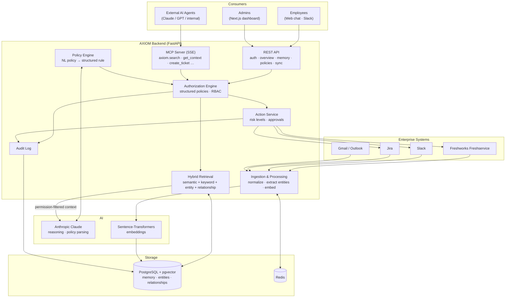

# AXIOM

The memory layer for enterprise AI: a unified, permission-aware context layer that serves employees and AI agents across the systems they already use.

## What it is

AXIOM connects an organization's existing systems (Freshservice, Slack, Jira, Gmail) and builds a continuously updated **organizational memory** out of them: people, teams, projects, tickets, conversations, decisions and how they relate. It exposes that memory to employees through web chat and Slack, and to AI agents through MCP. Every request goes through a deterministic, policy-driven authorization engine.

## What it does (business objective)

Companies have plenty of data but no unified memory. The customer email, the Slack debate, the Jira issue and the Freshservice incident behind one business event all live in different tools. AXIOM:

- **Reconstructs context across systems.** It can answer questions like *"Why is the customer's payment issue still unresolved?"* with grounded evidence (source, timestamp, link), and says *"not enough evidence"* instead of guessing.
- **Enforces natural-language policy.** Admins write rules such as *"Only HR administrators can access compensation information"*. AXIOM turns each rule into a structured policy and evaluates it deterministically. The LLM is never the security boundary.
- **Filters by permission before retrieval.** Only authorized context ever reaches the model.
- **Takes controlled actions.** It can create or update Jira issues and Freshservice tickets and send Slack messages. Actions are gated by risk level, approvals and the same authorization engine.
- **Gives agents one shared, governed integration.** AI agents get enterprise context through AXIOM's MCP server instead of each one integrating separately with every system.
- **Keeps a full audit trail.** Every retrieval, denial, policy decision and action is logged.

Target outcomes: faster answers to cross-system questions, fewer repeated rediscoveries of institutional knowledge, and **zero unauthorized successful actions**.

## What it doesn't do (out of scope)

- **Not a system of record.** Source systems stay authoritative. AXIOM keeps a contextual index and does not replace them.
- **Not a general enterprise search or dashboard product.** The admin UI is deliberately minimal (overview, memory explorer, policies, agents, audit).
- **Not an IAM/SSO provider.** It consumes identity and roles but does not manage user identities.
- **No LLM-decided authorization.** Access decisions are never delegated to the model.
- **Nothing beyond the MVP connectors yet.** Meeting notetakers, Google Drive, SharePoint, Confluence, GitHub, HRIS and Salesforce are on the roadmap (P1), not built.
- **No exposure of data just because a connector can fetch it.** Anything a connector retrieves is still subject to policy.

## Product Integrations

- **Freshworks Freshservice**: reads tickets, requesters, conversations, assets and status into memory, and runs ticket actions (create, update, add note, assign, change status).
- **Anthropic Claude (Sonnet)**: the primary reasoning model. It produces grounded answers over the permission-filtered context package and parses natural-language policies into structured rules.
- **Slack**: ingests messages, channels, threads and users. It also serves as an employee chat interface and an action target (send messages and replies).
- **Jira**: ingests issues, comments, projects and status, and runs issue actions (create, update, comment, assign).
- **Gmail / Outlook** (planned for MVP): read-only ingestion of customer and internal email threads.
- **Model Context Protocol (MCP)**: exposes AXIOM tools (`axiom.search`, `axiom.get_context`, `axiom.create_ticket`, …) to external AI agents, with authorization on every call.
- **PostgreSQL + pgvector**: stores memory entities and relationships and runs vector similarity search.
- **Sentence-Transformers (`all-MiniLM-L6-v2`)**: generates embeddings locally for semantic retrieval.
- **Redis**: caching and background job coordination.

## System Interaction Diagram

